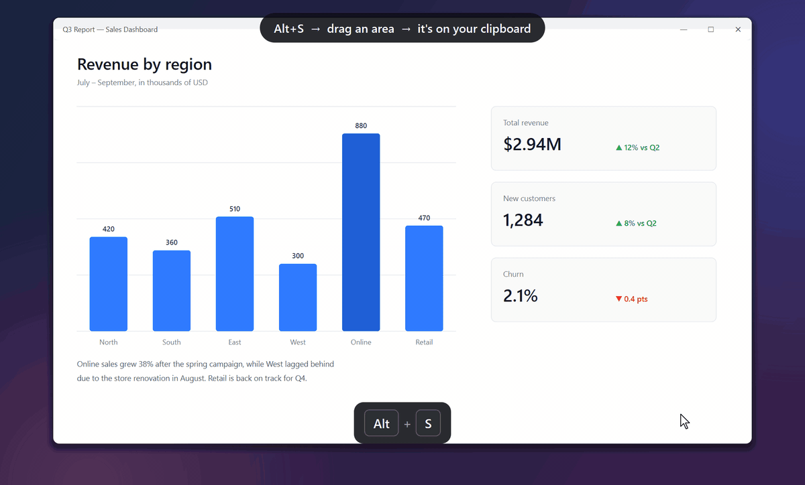
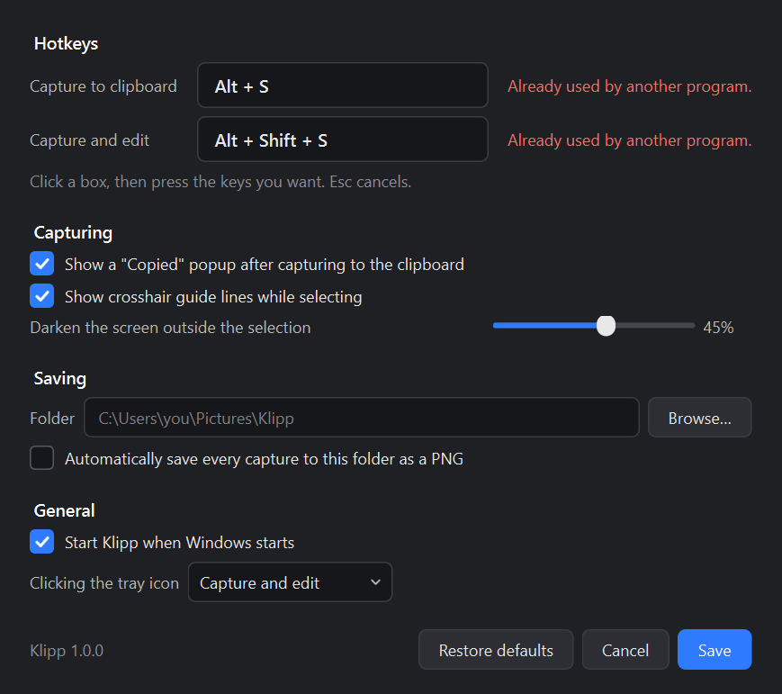

# Klipp

**Alt+Shift+S, drag, draw, Ctrl+V.** Screenshots on Windows without opening an app or saving a file.



**[Download Klipp for Windows](https://github.com/nilsperssonsuorra/klipp/releases/latest)**. Unzip it and run `Klipp.exe`. No installer, no account.

## What it does

- **Alt+S** freezes the screen so you can drag out an area. The area goes straight to the clipboard.
- **Alt+Shift+S** does the same, then opens the area in the editor.
- The editor has a pen, highlighter, line, arrow, rectangle and ellipse, plus 11 preset colors you pick with one click.
- Holding the right mouse button and dragging erases every stroke you touch. It removes whole strokes, the way Snipping Tool does, and works whichever tool is selected.
- Every change in the editor is copied to the clipboard right away, so you can paste at any point without pressing Copy.
- Captures keep full resolution on high-DPI screens. A 4K screen at 150% scaling gives you 4K pixels.

Klipp runs in the system tray and starts with Windows. You can turn that off in Settings.

## Install

1. Download `Klipp-<version>-windows.zip` from the [latest release](https://github.com/nilsperssonsuorra/klipp/releases/latest).
2. Unzip it wherever you want to keep it, for example `C:\Tools\Klipp`.
3. Run `Klipp.exe`. It adds an icon to the system tray.

Klipp isn't code-signed yet, so Windows SmartScreen may warn you the first time. Click **More info**, then **Run anyway**.

To update, quit Klipp from the tray icon, replace the folder with the new version and start it again. Your settings are kept.

### Build it yourself

With Python 3.12 on Windows 10 or 11:

```powershell
git clone https://github.com/nilsperssonsuorra/klipp.git
cd klipp
python -m venv .venv
.venv\Scripts\pip install -r requirements-dev.txt
.\build.ps1
```

This creates `dist\Klipp\Klipp.exe` and a release zip in `dist`.

## Using it

While selecting an area, press **Esc** or right-click to cancel.

In the editor:

| Input | Action |
|---|---|
| Left-drag | Draw with the current tool |
| Right-drag | Erase the strokes you touch |
| P, H, L, A, R, O, E | Pen, highlighter, line, arrow, rectangle, ellipse, eraser |
| 1 to 9, 0 | Pick one of the first ten colors |
| `-` and `+` (or `[` and `]`) | Smaller or bigger brush |
| Shift while drawing | Straight lines in 45° steps, perfect squares and circles |
| Ctrl+Z, Ctrl+Y | Undo, redo |
| Ctrl+S | Save as PNG or JPG |
| Ctrl+scroll, Ctrl+0, Ctrl+1 | Zoom, fit to window, actual size |
| Middle-drag | Pan |

## Settings

Right-click the tray icon and choose **Settings…**.



To change a hotkey, click its box and press the new key combination. Klipp checks whether another program already uses it. Plain letters need a modifier so they don't block normal typing. F-keys, PrintScreen and Pause work on their own.

The other settings:

- Show the "Copied" popup after a clipboard capture.
- Show crosshair guide lines while selecting.
- Choose how dark the screen gets outside the selection.
- Pick a folder for saved captures, and optionally save every capture there as a PNG. The default folder is `Pictures\Klipp`.
- Start with Windows.
- Choose what a left-click on the tray icon does.

Settings are stored in `%APPDATA%\Klipp\config.json`. You can edit that file by hand while Klipp isn't running.

## Development

```powershell
.venv\Scripts\python -m klipp               # run from source
.venv\Scripts\python tests\smoke_test.py    # automated checks
.venv\Scripts\python tools\make_demo.py     # re-render docs\demo.gif and docs\settings.png
```

The smoke test drives the editor, the settings window and the capture flow with simulated input. It briefly shows the selection overlay on screen. It posts hotkey messages to Klipp directly, so no real key presses reach other programs.

`make_demo.py` renders the README images off-screen using the real widgets on a staged desktop. It needs `ffmpeg` on your PATH.

To publish a release, bump `__version__` in `klipp/__init__.py`, commit, then push a matching tag such as `v1.0.1`. GitHub Actions builds `Klipp.exe` and attaches the zip to a new release.

Code layout:

| File | Contents |
|---|---|
| `klipp/app.py` | Tray icon, hotkey handling, capture flow |
| `klipp/overlay.py` | The frozen-screen selection overlay |
| `klipp/editor.py` | The drawing editor |
| `klipp/settings.py` | The settings window and hotkey recorder |
| `klipp/hotkeys.py` | Global hotkeys through the Win32 `RegisterHotKey` API |
| `klipp/config.py` | Loading and saving settings |

## License

MIT. See [LICENSE](LICENSE).
